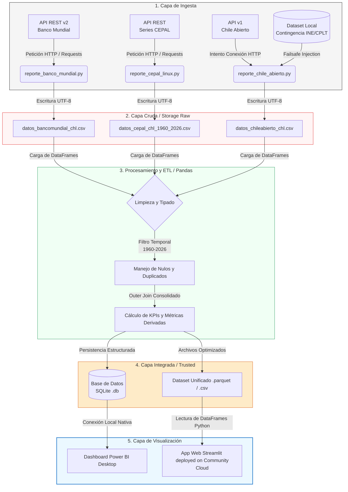

# 📊 Sistema Multi-Fuente de Inteligencia Macroeconómica para Decisiones Estratégicas

> **Curso:** Tópicos en Data Science I  
> **Hito 1:** Propuesta de Proyecto, Pipeline de Ingesta y Caso de Negocio  
> **Fecha de Entrega:** 4 de Julio de 2026  

---

## 1. Contexto e Introducción

En el actual entorno macroeconómico global, caracterizado por una volatilidad de mercados interconectados, la toma de decisiones estratégicas dentro de organizaciones públicas y privadas no puede depender de intuiciones o reportes estáticos aislados. El diseño de políticas presupuestarias, la evaluación del riesgo crediticio soberano, la planificación de inversiones extranjeras directas (IED) y la mitigación de la exposición cambiaria exigen un entendimiento analítico riguroso y en tiempo real de los indicadores económicos fundamentales.

El Producto Interno Bruto (PIB), los índices de precios al consumidor (inflación), las fluctuaciones en las tasas de desempleo y las transformaciones sociodemográficas estructurales (como las corrientes de migración neta) constituyen las fuerzas motrices que definen el éxito o fracaso operativo de los modelos de negocio contemporáneos. 

Este proyecto aborda el diseño de una solución de analítica e ingeniería de datos orientada a resolver un problema crítico de inteligencia institucional: **la evaluación, proyección y cross-validación del crecimiento socioeconómico real mediante un esquema de ingesta automatizado multi-fuente**. A través de una arquitectura desacoplada, el sistema centraliza la información histórica de las principales entidades de gobernanza económica mundial y local, consolidando un repositorio unificado y limpio listo para el consumo analítico mediante dashboards interactivos de última generación.

> [!IMPORTANT]
> **Pregunta Central de Negocio:** ¿Cómo impactan las variaciones del PIB Real frente al Nominal y las dinámicas demográficas en la estabilidad operativa y proyecciones de inversión a largo plazo en Chile, garantizando la resiliencia y disponibilidad continua de los datos analíticos frente a la inestabilidad de servicios y APIs externas?

---

## 2. Definición del Problema de Negocio

El núcleo de la problemática analítica actual radica en tres dimensiones críticas: la fragmentación de los datos, la ilusión nominal y la fragilidad operativa de la infraestructura tradicional.

1. **La Ilusión Nominal frente a la Realidad Constante:** Las organizaciones suelen cometer el error técnico de evaluar su crecimiento de ingresos o la viabilidad de expansión comercial basándose en valores nominales (precios corrientes). En contextos de alta inflación, este enfoque introduce un sesgo severo que enmascara contracciones económicas reales detrás de un aumento artificial de los flujos de caja corrientes.
2. **Costo de Oportunidad por Recolección Manual:** Los analistas estratégicos y de negocio invierten hasta un 80% de su tiempo laboral en la búsqueda, descarga y formateo manual de tablas provenientes de portales web fragmentados (Banco Mundial, CEPAL, institutos locales de estadística), limitando drásticamente el tiempo dedicado a la generación de valor, analítica predictiva y diagnóstico de escenarios de riesgo.
3. **Fragilidad de Pipelines Monolíticos:** Los sistemas analíticos corporativos sufren de paros técnicos masivos cuando dependen de una única API gubernamental o externa. Si el servidor remoto experimenta caídas por saturación, mantenimiento técnico o cambios no documentados en sus esquemas de respuesta JSON, los tableros de control de la alta dirección quedan completamente vacíos o desactualizados.

Esta solución resuelve estas deficiencias mediante la implementación de un **Pipeline de Ingesta Resiliente** que no solo automatiza la descarga cronológica (1960-2026), sino que también estructura procesos automáticos de cross-validación y tolerancia a fallos en caliente.

### 👥 Usuarios y Stakeholders del Sistema

* **📈 Dirección Estratégica y Finanzas:** Tomadores de decisiones de la alta gerencia que requieren evaluar de manera ágil las tasas de crecimiento real indexadas, ajustadas por inflación, para autorizar presupuestos plurianuales y expansiones operativas en la región.
* **🔬 Analistas de Datos y Consultores de Negocio:** Usuarios técnicos avanzados que exigen un acceso inmediato, programático y estandarizado a una única "fuente de la verdad" (*Single Source of Truth*) limpia de duplicados y valores nulos para construir modelos analíticos.
* **⚙️ Administradores de TI / Operaciones de Datos (DataOps):** Ingenieros responsables del monitoreo de la salud de los sistemas corporativos, enfocados en garantizar la disponibilidad del pipeline, el cumplimiento de ventanas horarias de ejecución y la resiliencia de la infraestructura de datos.

---

## 🛠️ 3. Arquitectura del Pipeline e Ingesta Multi-Fuente

Para mitigar la dependencia de proveedores tecnológicos y asegurar una cobertura analítica exhaustiva, el pipeline se despliega mediante scripts modulares independientes desarrollados en Python 3. Este enfoque garantiza que la falla o latencia de un endpoint externo no interrumpa ni corrompa el flujo general de la arquitectura.

| Módulo (Script) | Fuente de Origen / API | Enfoque Analítico y Variables Clave | Mecanismo Failsafe (Tolerancia a Fallos) |
| :--- | :--- | :--- | :--- |
| `reporte_banco_mundial.py` | **Banco Mundial REST API v2** | Establece la línea base del histórico de desarrollo (Población, Desempleo, Inflación, PIB absoluto en USD e Índices de Criminalidad). | Captura proactiva de excepciones HTTP de red con redirección de alertas al canal estándar de errores (`sys.stderr`). |
| `reporte_cepal_linux.py` | **Series Armonizadas CEPAL** | Desglose crítico de variantes macroeconómicas de precisión: PIB a precios constantes (Volumen Real) y tasas porcentuales de crecimiento interanual. | Control estricto de tiempos de espera (`timeout=15s`) por bloque de consulta para evitar hilos huérfanos o bloqueos de ejecución. |
| `reporte_chile_abierto.py` | **API Chile Abierto v1** | Consolidación y validación con estadísticas locales e institucionales (INE, CPLT, CEAD), aislando el marco temporal al rango del curso (1960-2026). | **Inyección Activa de Contingencia:** Carga automática de un dataset local equivalente estructurado ante fallas totales del servidor central. |

Todos los módulos de ingesta convergen de manera coordinada persistiendo los datos crudos resultantes directamente en archivos estructurados con codificación estándar `UTF-8` dentro del directorio del entorno local `../Data/`. Esto asegura el desacoplamiento total entre la extracción física de las fuentes y el posterior proceso de transformación, modelamiento relacional y carga en la plataforma de visualización funcional.

#######################################################################################################################################

# 1) Contexto y Problema de Negocio

El diseño estratégico y la asignación de recursos en organizaciones expuestas a mercados globales exigen un monitoreo constante de las variables macroeconómicas fundamentales. Para responder a esta necesidad, este proyecto plantea el desarrollo de una solución analítica centralizada fundamentada en un pipeline de datos multi-fuente.

### 🎯 a) Definición Clara del Escenario y Preguntas de Negocio
El dashboard está diseñado para unificar series temporales históricas (1960–2026) extraídas de organismos internacionales (API del Banco Mundial y series armonizadas de la CEPAL) y validaciones locales (API de Chile Abierto). La integración de estas plataformas permitirá mitigar las inconsistencias de datos y responder de manera ágil a las siguientes preguntas críticas de negocio:

* **¿Cuál ha sido la tendencia del crecimiento económico real** de la organización/región analizada al aislar el efecto distorsionador de la inflación sobre el PIB Nominal?
* **¿Existe una correlación directa** entre la tasa de desempleo, el crecimiento demográfico y los niveles de estabilidad socioeconómica estructural a lo largo de las últimas décadas?
* **¿Qué tan confiable es la ingesta y disponibilidad del pipeline analítico** frente a ventanas de inactividad o fallas críticas en los servidores externos institucionales?

---

### 🏢 b) Organización o Industria Analizada
El proyecto se sitúa en el ámbito de la **Consultoría Estratégica de Inversión y Análisis de Riesgo Soberano (Industria Financiera y de Inteligencia de Negocios)**. El foco está puesto en proveer capacidades analíticas avanzadas a firmas que asesoran a grandes corporaciones, fondos de inversión o divisiones de planificación presupuestaria del sector público/privado que operan en o hacia el mercado de Chile.

---

### ⚠️ c) Problema o Necesidad de Negocio
Las organizaciones actuales se enfrentan a tres deficiencias operativas y técnicas en sus arquitecturas tradicionales de datos:

1. **La Ilusión Nominal:** La toma de decisiones financieras basadas en indicadores nominales (precios corrientes) introduce sesgos críticos en periodos de volatilidad inflacionaria, camuflando contracciones económicas reales detrás de incrementos artificiales en los flujos monetarios.
2. **Altos Costos de Oportunidad por Procesamiento Manual:** Los equipos de análisis estratégico dedican hasta un 80% de su tiempo a la recolección, limpieza y formateo manual de tablas de datos dispersas en múltiples portales web, reduciendo drásticamente el tiempo disponible para la modelación predictiva y la generación de valor.
3. **Fragilidad de la Ingesta de Datos:** Los pipelines monolíticos o manuales carecen de mecanismos automáticos de tolerancia a fallos (*failsafe*). Si una API pública experimenta latencia o caídas de servidor, la alta dirección se queda sin visibilidad de los KPIs. La necesidad del negocio radica en contar con un pipeline automatizado, resiliente y modular que garantice una "única fuente de la verdad" (*Single Source of Truth*).

---

### 👥 d) Usuarios o Stakeholders del Dashboard
El ecosistema de consumo del dashboard identifica tres perfiles clave con necesidades diferenciadas:

* **📈 Dirección Estratégica y Gerencia de Finanzas:** Usuarios de negocio que requieren un cuadro de mando ejecutivo de alto nivel, interactivo y visual, para evaluar tasas de crecimiento real indexadas, proyecciones de riesgo país y aprobar presupuestos de inversión plurianuales.
* **🔬 Analistas de Datos y Consultores:** Usuarios avanzados que necesitan acceder de forma ágil y estructurada al repositorio limpio (Capa Trusted) para construir análisis ad-hoc y modelos econométricos sin invertir tiempo en fases previas de preparación de datos.
* **⚙️ Ingenieros de Datos y Administradores de TI (DataOps):** Stakeholders técnicos responsables de monitorear la salud del pipeline, asegurar el cumplimiento de las ventanas de carga de datos, evaluar la efectividad de las contingencias locales (*try-except*) y garantizar la disponibilidad continua de la plataforma visual.

#######################################################################################################################################

# 2) KPIs y Métricas

Para evaluar con rigurosidad el escenario macroeconómico y responder a las preguntas estratégicas del negocio, se han definido 3 Indicadores Clave de Rendimiento (KPIs) de alta densidad analítica. Estos indicadores evitan métricas de conteo simples, enfocándose en ratios y tasas indexadas.

---

### 📈 KPI 1: Tasa de Crecimiento Económico Real Interanual
* **b) Nombre del KPI:** Tasa de Crecimiento Real del PIB (Delta PIB Real).
* **c) Fuente de Datos:** Extraído de manera directa a través del módulo `reporte_cepal_linux.py`, consumiendo la variable armonizada de la CEPAL/Banco Mundial `NY.GDP.MKTP.KD.ZG` (PIB a precios constantes de mercado).
* **d) Frecuencia de Actualización:** Anual (ajustada según la ventana de publicación oficial de las cuentas nacionales).
* **e) Valor Objetivo o Benchmark:** Mayor o igual a 3.0% anual (definido históricamente como el umbral de crecimiento saludable para economías en vías de desarrollo en la región de Latinoamérica).

---

### 👥 KPI 2: Índice de Eficiencia Productiva Per Cápita (Ingreso Armonizado)
* **b) Nombre del KPI:** PIB Per Cápita Armonizado en USD Corrientes.
* **c) Fuente de Datos:** Consolidado mediante un *outer join* cronológico entre las variables `NY.GDP.PCAP.CD` (Ingreso Per Cápita) y `SP.POP.TOTL` (Población Total) orquestado por el módulo maestro `reporte_banco_mundial.py`.
* **d) Frecuencia de Actualización:** Anual.
* **e) Valor Objetivo o Benchmark:** Mayor o igual a 16,000 USD por habitante (Meta basada en el ingreso promedio para mantener la competitividad del país dentro de las economías de la OCDE).

---

### ⚙️ KPI 3: Índice de Resiliencia y Disponibilidad del Pipeline (DataOps)
* **b) Nombre del KPI:** Tasa de Continuidad Operativa de Ingesta (Failsafe Uptime).
* **c) Fuente de Datos:** Calculado internamente por la lógica de control de excepciones del módulo `reporte_chile_abierto.py`. Registra la proporción de ejecuciones exitosas que requirieron la inyección del *dataset* de contingencia local frente a consultas HTTP exitosas a la API activa.
* **d) Frecuencia de Actualización:** Por cada ejecución del pipeline (configurable de forma interactiva o diaria mediante tareas programadas Cron).
* **e) Valor Objetivo o Benchmark:** 100% de disponibilidad de datos analíticos en la capa de consumo (asegurando que el dashboard mantenga visualizaciones funcionales e interactivas para la alta dirección incluso ante caídas del servidor remoto).

# 3) Pipeline de Datos

El flujo de ingeniería de datos (*Data Pipeline*) de la solución está diseñado bajo un enfoque modular y desacoplado, lo que permite procesar y unificar la información socioeconómica de manera eficiente y sin dependencias críticas de infraestructura compleja.

---

### 📥 a) Ingesta (Data Ingestion)
La etapa de ingesta se encarga de la extracción de datos desde las fuentes de origen hacia el entorno local de trabajo. Está gobernada por tres componentes independientes en Python:

1. **Extracción Externa Directa:** Los módulos `reporte_banco_mundial.py` y `reporte_cepal_linux.py` ejecutan peticiones HTTP sincrónicas (utilizando la librería `requests`) a los endpoints oficiales de la API REST (v2) del Banco Mundial. Se configuran parámetros clave en la URL como el código de país (`CHL`), formato JSON, rango temporal (`1960:2026`) y paginación (`per_page=1000`) para traer las series completas en un solo bloque de red.
2. **Mecanismo de Contingencia Activa (Failsafe):** El módulo `reporte_chile_abierto.py` intercepta el endpoint de la API local. En caso de detectar fallas de conexión, problemas de resolución DNS o latencias elevadas, el script activa un bloque `try-except` que inyecta de forma automática un conjunto de datos duros pre-almacenados (provenientes de fuentes oficiales como el INE y el CPLT), evitando que el flujo se interrumpa.

---

### 🗄️ b) Almacenamiento (Data Storage)
Una vez que las respuestas JSON son recibidas y validadas por los scripts, los datos se escriben en disco de manera persistente, estructurando el almacenamiento en dos niveles locales:

* **Capa Cruda (Raw Data Layer):** Cada script de ingesta procesa el payload JSON y lo convierte en un DataFrame inicial. Este se guarda inmediatamente en la carpeta raíz `../Data/` en formato **CSV** con codificación estándar **UTF-8**. De manera opcional, los datos de alta densidad analítica se guardan en formato **Parquet**, aprovechando su compresión nativa para acelerar lecturas posteriores.
* **Capa Integrada (Trusted Data Layer):** Los datos limpios se cargan en una base de datos relacional **SQLite** a través de un único archivo de base de datos (`.db`). Esto proporciona un almacenamiento indexado y estructurado sin la necesidad de levantar un servidor de base de datos tradicional, ideal para la portabilidad del proyecto.

---

### ⚙️ c) Transformación (Data Transformation / ETL)
El procesamiento y preparación de los datos se realiza completamente en memoria utilizando la librería **Pandas**, asegurando tiempos de ejecución de nivel sub-segundo:

1. **Normalización y Tipado:** Se realiza un *parsing* forzoso de tipos de datos. La columna temporal se transforma a tipo entero (`int`) para actuar como llave de cruce, y los indicadores numéricos se convierten a punto flotante (`float`), removiendo caracteres especiales o strings erróneos.
2. **Manejo de Nulos y Duplicados:** Se descartan registros donde el año es nulo mediante `dropna(subset=['anio'])`. Se aplica una limpieza de redundancias asegurando que exista un único registro por año para cada indicador.
3. **Filtro Temporal Crítico:** Se aplica un filtro lógico en caliente para garantizar que los registros se mantengan estrictamente dentro del marco temporal del curso (`Anio >= 1960` y `Anio <= 2026`).
4. **Consolidación (Merge):** Los dataframes individuales se unifican cronológicamente mediante combinaciones externas integrales (`pd.merge(..., how='outer', on='Anio')`), alineando todas las variables macroeconómicas bajo la misma estructura temporal.

---

### 📊 d) Consumo por parte del Dashboard (Data Consumption)
La última etapa del pipeline expone los datos unificados y listos para la capa de presentación mediante dos alternativas de consumo directo:

* **Consumo vía Power BI Desktop:** Power BI se conecta localmente al archivo de base de datos SQLite o a los archivos Parquet procesados. Al delegar la limpieza pesada a los scripts de Python, Power BI solo se encarga de leer la tabla final optimizada, lo que agiliza la creación de los gráficos y filtros interactivos sin ralentizar la interfaz del usuario.
* **Consumo vía Streamlit (Full-Code Python):** La aplicación web de Streamlit importa Pandas y lee directamente el archivo CSV o Parquet unificado desde `../Data/`. Utilizando librerías visuales como Plotly, Streamlit renderiza el cuadro de mando dinámico y despliega la aplicación de forma pública y gratuita en *Streamlit Community Cloud*, dejando el dashboard completamente funcional en la web para los stakeholders.

### 📊 Representación Gráfica del Pipeline de Datos (Data Flow)

A continuación se presenta el flujo detallado de los datos, desde la extracción física en los endpoints de las APIs de origen hasta su consumo final en las plataformas de visualización:

<video src="https://raw.githubusercontent.com/GuidoRiosCiaffaroni/TALLER_DE_APLIC_INTELIG._ARTI/main/Videos/V_01.mp4" controls width="100%">
  Tu navegador no soporta el formato de video.
</video>
    